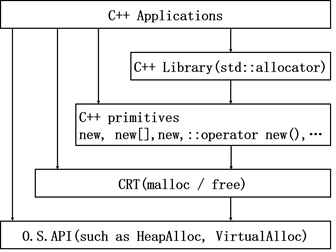

# 总览

C++内存管理是一个比较重要的一个话题，一个好的内存管理可以增加程序的鲁棒性，提高运行效率以及合理有效的利用有限的内存空间。本博客是根据侯捷老师在Boolan上面的课《C++内存管理》整理的，中间也会穿插一些其他方面的内存管理内容。

#### 相关资源

1、课程：侯捷老师的《C++内存管理》https://www.bilibili.com/video/av24603588/?spm_id_from=333.788.videocard.0

2、博客：Dougle写的malloc：<http://g.oswego.edu/> 

3、书籍：《STL源码剖析》 和《深入理解计算机系统》

## 内存分配的每一个层面



<center>C++内存管理的4个层面</center>

如上图所示，在C++中内存管理的层次有4层，分别是：

1、 C++标准库提供的std::allocator这个分配器。

2、 C++的原生构件，比如new、new[ ]、::operator new等等。

3、 C标准库函数malloc和free。

4、 操作系统分配内存的函数，这个和操作系统有关，我们一般不会去操作。

一般对于一个C++应用来说，其内存管理都是分层调用的。比如我们使用C++标准库中的容器，容器中会调用std::allocator这个分配器，而目前一般的分配器会调用::operator new和::operator delete这些C++内存分配的构件，那如果我们要深挖源代码的话，::operator new和::operator delete会调用malloc和free函数，那么malloc和free这些函数继续还是会调用操作系统的函数。在后面会将这一层层的调用关系给讲解明白，下表是这四层函数的简介归纳。

<center>C++基本内存函数归纳</center>

|       内存分配函数       |        内存释放函数        |   类别    |    可否重载    |
| :----------------------: | :------------------------: | :-------: | :------------: |
|         malloc()         |           free()           |   C函数   |      不可      |
|           new            |           delete           | C++表达式 |      不可      |
|     ::operator new()     |    ::operator delete()     |  C++函数  |       可       |
| allocator<T>::allocate() | allocator<T>::deallocate() | C++标准库 | 可自由搭配容器 |

## 四种内存管理函数使用

以下是四种内存管理函数的使用方法：

<center>四种内存管理函数使用方法</center>

```c++
#include <iostream>
#include <cstdlib>
#include <complex>
#include <ext/pool_allocator.h>
#include "../include/test.h"
using namespace std;

int test1(){
    void *p1 = malloc(512);
    free(p1);

    complex<int>* p2 = new complex<int>;
    delete p2;

    void* p3 = ::operator new(512);
    ::operator delete(p3);

#ifdef __GNUC__
    int* p4 = allocator<int>().allocate(3, (int*)0);	//使用allocator分配，需要指定分配对象的类型和个数
    allocator<int>().deallocate(p4, 3);			//在回收内存的时候需要指定回收的指针和回收的相应的个数，这个比较烦人
    cout << __GNUC__ << endl;
    cout << "正在使用GNU的分配器" << endl;
    
    //正在使用__gnu_cxx命名空间下的__pool_alloc分配器，这个分配器质量比较好
    void* p5 = __gnu_cxx::__pool_alloc<int>().allocate(9);
    __gnu_cxx::__pool_alloc<int>().deallocate(static_cast<int*>(p5), 9);
#endif
    return 0;
}
```

在上表中比较有意思的是标准库自带的allocator分配器在回收内存空间的时候需要传入指针和相对应的元素个数，比如例子中回收内存的时候要把3个int给传入进去。（如果这里的allocator和deallocator只是简单的包装new和delete这两个函数的话，那deallocate函数传入的个数就没啥意义，实际上应该是用不到的。但是如果我们的allocator考虑了内存池的设计，那么deallocate实际上并不是回收内存，而是在某些地址上调用相应的析构函数来将若干个对象析构掉，这样这个传入的表示个数的实参就有用处了，后面具体要看C++内存池的设计原理），这个是其他构件所没有的。我们看allocator的第二种用法，这里我们使用了\__gnu_cxx（一些比较好的std的扩展）命名空间下\__pool_alloc这个分配器，那\__pool_alloc分配器和std::allocator这两个分配器有啥区别呢std::allocator分配器只是对new和delete这两个函数进行了简单的包装，但是\__pool_alloc这个分配器则是采用了内存池的技术，更加好一点。那么STL为什么不用更好的\__pool_alloc这个分配器呢，或许是现在计算机的内存比较多吧（😄）。

